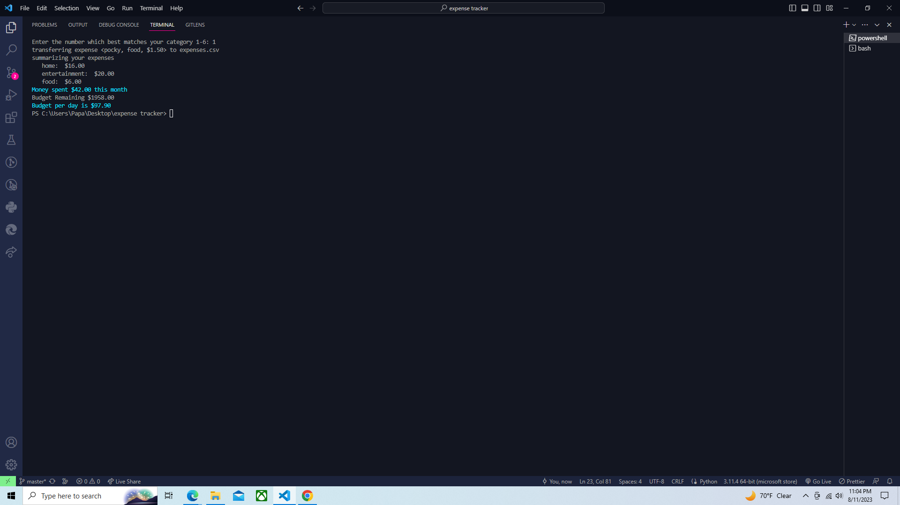
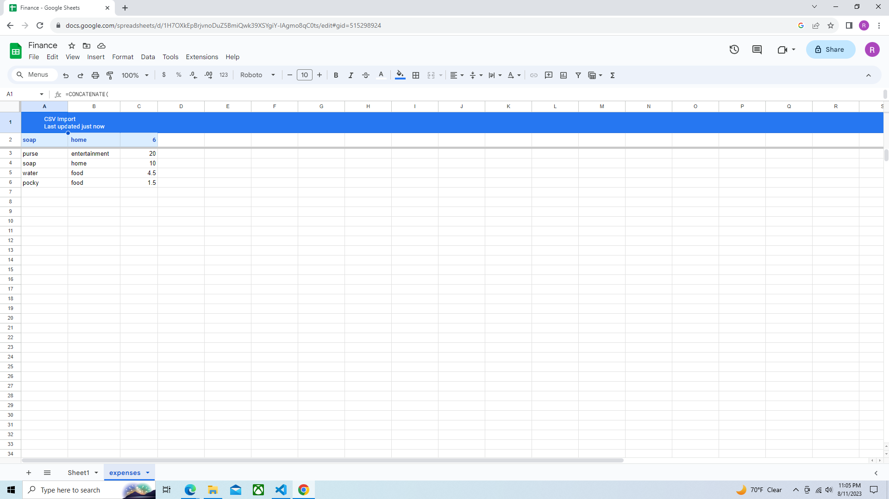

## Expense Tracker 

This is an app to track monthly expenses. It moves user inputs to a csv file which then moves the information to a google sheets. The csv could also be linked to an excel document.(Note~ this is a very basic app)

   

## Use

This program runs from the terminal. Users must define their budget for the month. They will then be asked to input a purchase item and the cost of that item. Then they'll be prompted to select which category of expenses the item belongs to. Afterwards, the program will summarize how much they've spent on each category and what their remaining budget is for the month. It also transfers this information to a google sheet so the user can have a clear view of their purchases and budget accordingly. 